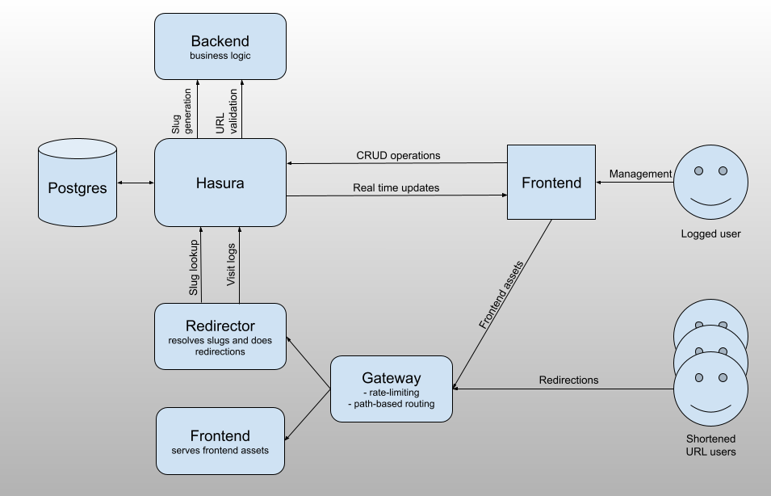

# Deep Shortigin


## Introduction

Deep Shortigin is a URL shortening service. It allows users to create a shortened version of a URL.

## Live demo

Visit [https://shortigin.maciaszek.pl](https://shortigin.maciaszek.pl) to see the live demo.

## Getting started

You need to have Docker installed on your machine. The service is composed of multiple containers, and Docker Compose is used to manage them.

After cloning the repository, please move `.env.template` to `.env` and fill the variables. You might have also received the file with the filled variables.

To start the service, run the following command:

```bash
docker compose up
```

The service should be available at [http://localhost:4050](http://localhost:4050).

## Architecture



Solution consists of the following components:
- Postgres database: stores shortcuts and visits
- Hasura GraphQL engine
  - provides a GraphQL API
  - manages user permissions (in a very effective way)
- Redirector: a service that redirects to the target URL
- Backend: a service that handles business logic
  - Slug creation based on Hashids
  - URL validation using `fetch`
- Frontend: a React application + webserver for serving assets
- Gateway: an Nginx server that routes requests to the appropriate service
  - since we are using the same domain for all services, the gateway is responsible for routing requests between redirector and frontend server
  - additionally, it provides rate limiting for the redirector service

## Implemented features

### Required features

- ✅ Build a web page with a form for entering a URL
- ✅ When the form is submitted, return a shortened version of the URL
- ✅ Save a record of the shortened URL to a database
- ✅ Ensure the slug of the URL (abc123 in the screenshot above) is unique
- ✅ When the shortened URL is accessed, redirect to the stored URL
- ✅ If an invalid slug is accessed, display a 404 Not Found page

### Additional features

- ✅ Add support for accounts so people can view the URLs they created - Validate the URL provided is an actual URL
  - Accounts are implemented using [Auth0](https://auth0.com) service
- ✅ Display an error message if invalid
- ✅ Make it easy to copy the shortened URL to the clipboard
- ✅ Allow users to modify the slug of their URL
- ✅ Track visits to the shortened URL
- ✅ Add rate-limiting to prevent bad-actors from spamming the service
  - Rate limiting is configured on gateway `nginx`
- ✅ Update API to follow a known spec (such as json:api)
  - comment: I chose GraphQL

## Motivation behind specific solutions

### Hasura GraphQL engine

Hasura is a GraphQL engine that connects to the Postgres database and provides a GraphQL API. I chose it because of the following reasons:

- Provides CRUD GraphQL operation out-of-a-box
- Permissions - it allows to define permissions in a declarative way, they are enforced at the SQL query level
- Real-time updates through websockets with subscriptions
- Allowed me to focus on project specific business logic, not on the boilerplate code
  - the backend service is very thin, it only contains two endpoints (slug generation and URL validation)

### GraphQL

The service uses GraphQL for the API. Among the well-known benefits of GraphQL, I chose it because of the following reasons:

- The API is internal, not meant for public use.
- Subscriptions - the service uses real-time updates.
- Strongly typed - the schema is defined in the code, and the TypeScript typings are generated automatically.


### io-ts for input type validation

The backend leverages `io-ts` for input type validation. It is sibling of `fp-ts` - a functional patterns programming library. It adds a powerful mechanism where I can define the input structure once, and I get the parser (decoder) and TypeScript typings in return. Both are dynamically generated - no additional tools, no code generation. It is a great choice for protecting the backend from the invalid input, which could possibly travel through the whole application leading to unpredictable behavior.

### Redirection HTTP status code

The service uses `302` for redirection. It is because the underlying target URL of a slug can be edited in the UI. If `301` is used, browsers/proxies could cache the redirection ad future editing would be cumbersome.

### Slug generation

Slug generation is based on [Hashids](https://www.npmjs.com/package/hashids) library. It generates a unique slug for a given integer id. The slug is generated using the following characters: `[a-zA-Z0-9]`.
It is not a cryptographic hash function, rather it is a obfuscation algorithm. 

- ✅ With the library, we can generate a unique slug without the need for a database check and possible retries in case of collisions.
- ✅ Non-trivial output → The output looks random (xYz8Aq instead of 12345).
- ✅ Collision-free → Every number gets a unique encoded string.
- ✅ Always ensures a minimum of 6 characters.
- ❌ The slug is only protected by the randomness of the supplied alphabet and salt.
- ❌ Technically, it is possible to discover a way to reverse the slug to the original ID.

I considered other options, like symmetric encryption, but the resulting slug were too long (which makes quite sense).


### URL Validation

I use fetch to validate both the correctness of the URL and existence of target resource. Certain sites (like Facebook) block suspicious requests. To mitigate this, there is a set of hardcoded, naturally looking headers.

## Utils

### Redirection rate limiting test

```bash
for i in {1..50}; do curl -s -o /dev/null -w "Request $i: HTTP Status %{http_code}\n" http://localhost:4050/rpvjp3; done
```
